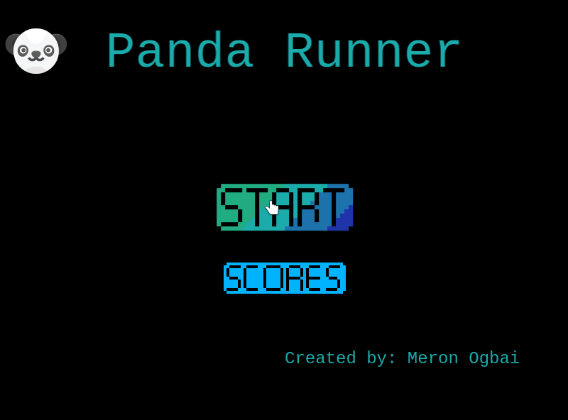
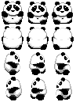

# Panda Runner

> This is a game where you play the role of a panda and collect as many coins as you can before falling over a platform or getting hurt.

## Game Design

### Concept

- Play as a cute panda and collect goodies while jumping from platform to platform and avoiding traps.
- Collect gold coins to increase your score.
- Avoid falling off platforms or touching spikes to not lose the game.

### Controls

You need a keyboard to control the panda.

- Press ⬆️ to jump.
- Press ➡️ to go right.
- Press ⬅️ to go left.

### Assets

|Asset                                      |Description                            |
|-------------------------------------------|---------------------------------------|
|          |Panda spritesheet to animate the player|
| |Platform that the player can jump on   |
||World background                       |
|       |Gold coins that the player can collect |
|        |Spikes that the player needs to avoid  |

## Built With

- Javascript
- Phaser
- Webpack, Babel and Jest

## Live Demo

[Live Demo Link](https://meronokbay.github.io/panda-runner/)

## Getting Started

To get a local copy up and running follow these simple example steps.

### Prerequisites

- Node.js
- npm

### Setup

Run `git clone git@github.com:meronokbay/panda-runner.git` in your terminal to clone this repo.

### Install

Install the necesarry dependencies by running `npm install` in the root of cloned repo.

### Usage

Run `npm start` to view the game in your default browser.

### Testing

Run `npm test` to run the tests.

## Authors

👤 **Meron Ogbai**

- Github: [@meronokbay](https://github.com/meronokbay)
- Twitter: [@MeronDev](https://twitter.com/MeronDev)
- Linkedin: [Meron Ogbai](https://linkedin.com/in/meron-ogbai/)

## 🤝 Contributing

Contributions, issues, and feature requests are welcome!

## Show your support

Give a ⭐️ if you like this project!

## Acknowledgments

- [Kenny](https://kenney.nl/)
- [OpenGameArt](https://opengameart.org/content/panda-character-32x32)

## 📝 License

This project is [MIT](./LICENSE) licensed.
